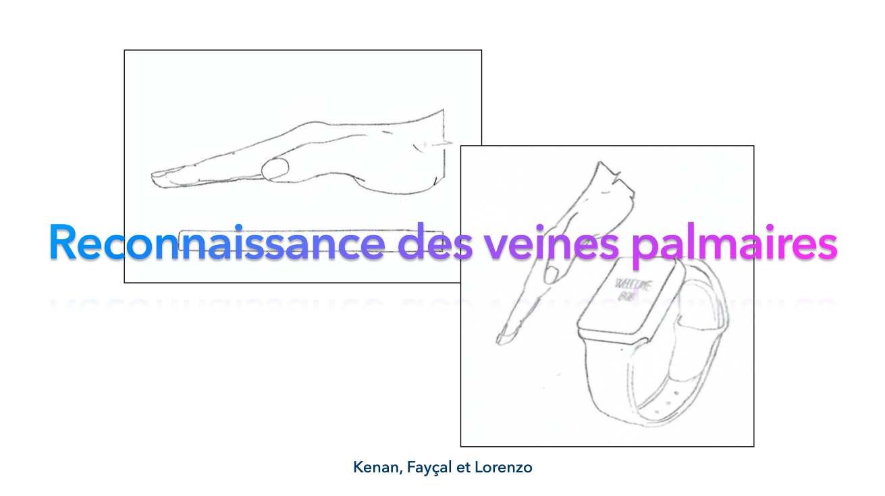
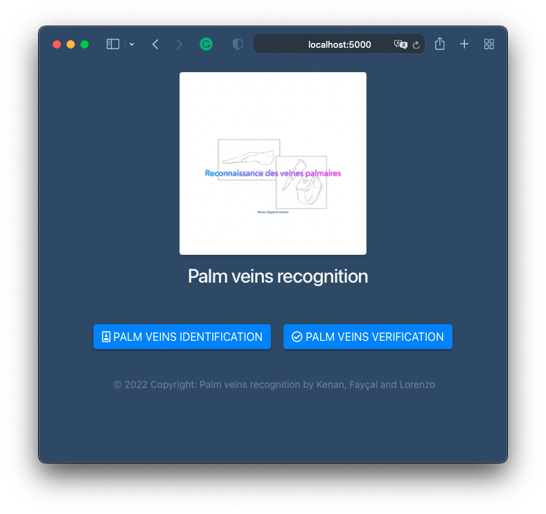
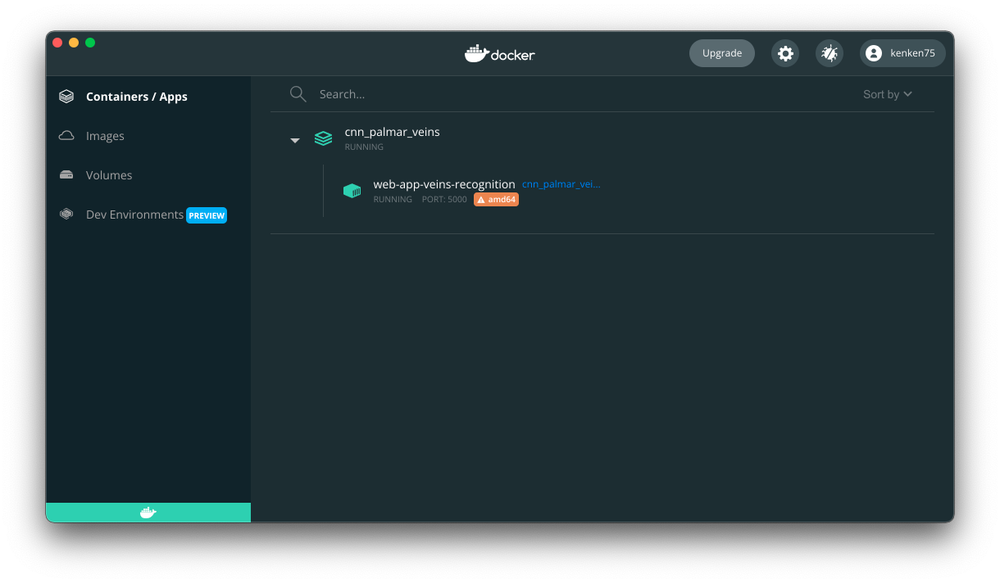
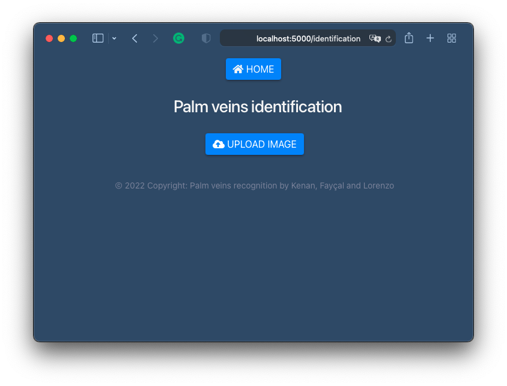
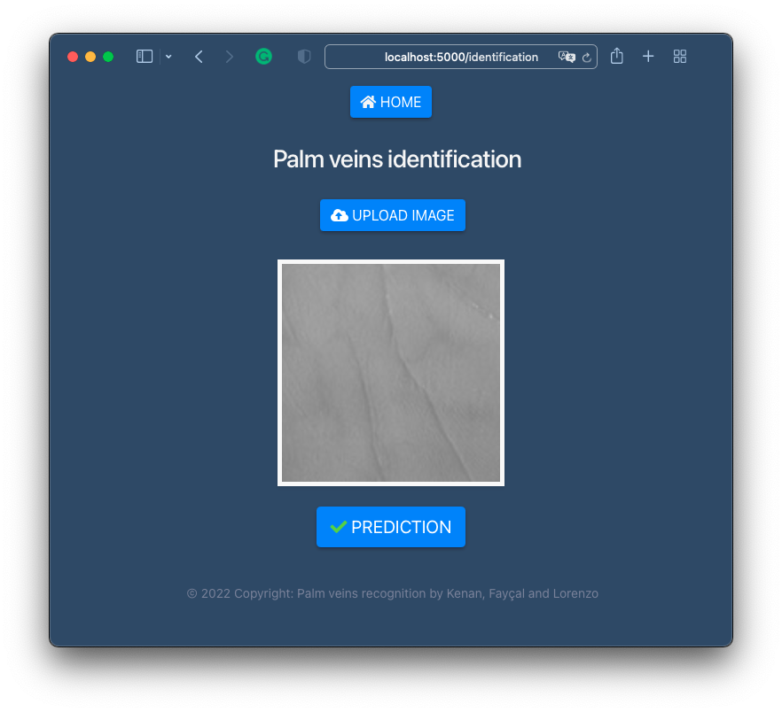
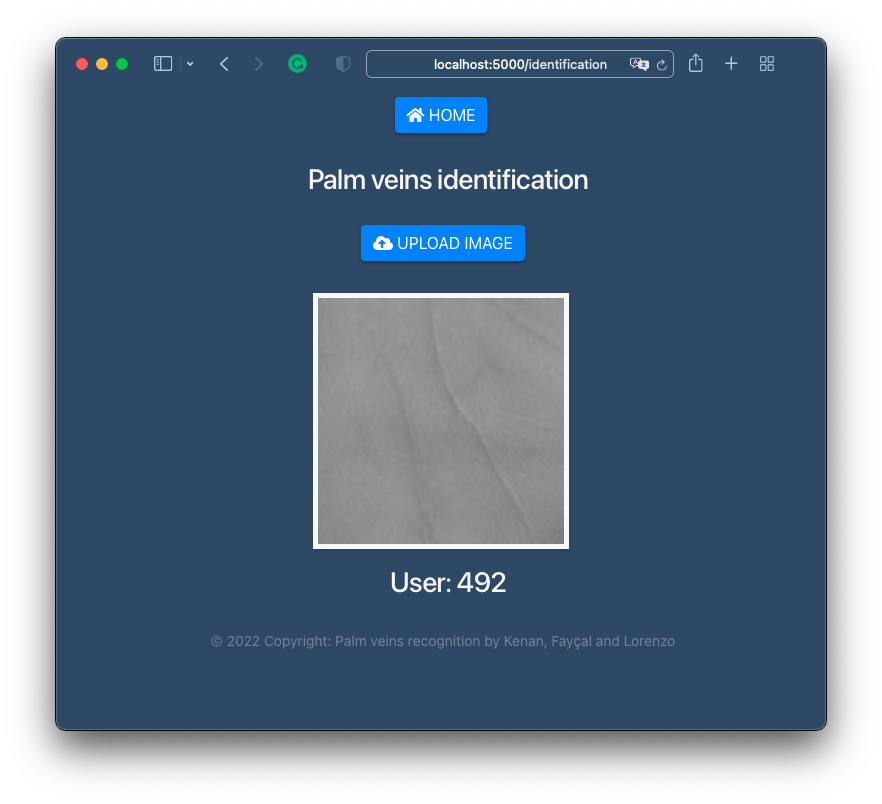

[comment]: <> ([![Contributors][contributors-shield]][contributors-url])

[comment]: <> ([![Forks][forks-shield]][forks-url])

[comment]: <> ([![Stargazers][stars-shield]][stars-url])

[comment]: <> ([![Issues][issues-shield]][issues-url])

[comment]: <> ([![MIT License][license-shield]][license-url])

[comment]: <> ([![LinkedIn][linkedin-shield]][linkedin-url])


<!-- PROJECT LOGO -->
<br />
<p align="center">
  <a href="https://github.com/kenanGonnot/cnn_palmar_veins">



<h3 align="center">Project Palm veins recognition</h3>

  <p align="center">
   By Kenan, Fayçal, and Lorenzo - Engineering students of the school ESME Sudria 
    <br />
    <br />
    <br />
  </p>


<!-- TABLE OF CONTENTS -->
<details open="open">
  <summary>Table of Contents</summary>
  <ol>
    <li>
      <a href="#about-the-project">About The Project</a>
      <ul> </ul>
    </li>
    <li>
      <a href="#getting-started">Getting Started</a>
      <ul>
        <li><a href="#installation">Installation</a></li>
      </ul>
    </li>
    <li><a href="#to-run-docker">To Run Docker</a></li>
    <li><a href="#contact">Contact</a></li>
  </ol>
</details>


<!-- ABOUT THE PROJECT -->

## About The Project



**GOAL :** Our goal is to train a model to recognize palm veins. "Palm veins" are the veins that are located on the palm
of the hand and is unique to everyone like a fingerprint.

Here are some of the model we have trained :

| Model           | Accuracy   | Loss     |
|-----------------|------------|----------|
| 1 Layer         | 99.11%     | 0.09     |
| ResNet 50       | 99.22%     | 0.15     |
| ResNet 150      | 96.11%     | 1.87     |
| EfficientNetB0  | 99.22%     | 0.19     |
| **Xception**    | **99.89%** | **0.01** |
| InceptionResNet | 99.67%     | 0.01     |

## Getting Started - Web App and Docker

### Installation

#### Docker

1. Install [docker](https://www.docker.com/get-started), and preferably also install docker-desktop.
2. Now you need to install docker compose, to do so run the following command to dl:
    ```bash
    sudo curl -L "https://github.com/docker/compose/releases/download/1.29.2/docker-compose-$(uname -s)-$(uname -m)" -o /usr/local/bin/docker-compose
    ```

3. Now we need to apply executable permissions to the binary to allow us to run compose
    ```bash
    sudo chmod +x /usr/local/bin/docker-compose
   ```

### To Run Docker

Type in the terminal (where the docker-compose.yml is), to run the project :

 ```bash
 docker-compose up -d
 ```

This will launch 1 containers : Python-Flask which is located at the directory "app".
(`app.py` file is the main file of the web application)

When every containers is running like this:



**Go to :**
[http://localhost:5000/](http://localhost:5000)


Now you can see the web app running. The application is running on port 5000 on mode `debug` and the web app is
accessible. 

You can go to the "palm veins identification" page.



Then you can upload your palm vein image.



When you press the button "Prediction" you will see the result of the model.



### To shutdown docker

When you have finished using the application :

To shutdown all the containers

```bash
docker-compose down
```

### To build all the images of your project docker

To rebuild all your images Docker

```bash
docker-compose build
```

<!-- CONTACT -->

## Contact

* Kenan - [Github](https://github.com/kenanGonnot)  - [LinkedIn](https://www.linkedin.com/in/kenan-gonnot/)
* Fayçal - [Github](https://github.com/Rellfix)  - [LinkedIn](https://www.linkedin.com/)
* Lorenzo - [Github](https://github.com/Lorenzo089) - [LinkedIn](https://www.linkedin.com)

Tuteur : Larbi BOUBCHIR - [larbi.boubchir@esme.fr](larbi.boubchir@esme.fr)

Project link: [Palm veins recognition](https://github.com/kenanGonnot/cnn_palmar_veins)


<!-- MARKDOWN LINKS & IMAGES -->
<!-- https://www.markdownguide.org/basic-syntax/#reference-style-links -->

[contributors-shield]: https://img.shields.io/github/contributors/othneildrew/Best-README-Template.svg?style=for-the-badge

[contributors-url]: https://github.com/othneildrew/Best-README-Template/graphs/contributors

[forks-shield]: https://img.shields.io/github/forks/othneildrew/Best-README-Template.svg?style=for-the-badge

[forks-url]: https://github.com/othneildrew/Best-README-Template/network/members

[stars-shield]: https://img.shields.io/github/stars/othneildrew/Best-README-Template.svg?style=for-the-badge

[stars-url]: https://github.com/othneildrew/Best-README-Template/stargazers

[issues-shield]: https://img.shields.io/github/issues/othneildrew/Best-README-Template.svg?style=for-the-badge

[issues-url]: https://github.com/othneildrew/Best-README-Template/issues

[license-shield]: https://img.shields.io/github/license/othneildrew/Best-README-Template.svg?style=for-the-badge

[license-url]: https://github.com/othneildrew/Best-README-Template/blob/master/LICENSE.txt

[linkedin-shield]: https://img.shields.io/badge/-LinkedIn-black.svg?style=for-the-badge&logo=linkedin&colorB=555

[linkedin-url]: https://www.linkedin.com/in/kenan-gonnot/

[product-screenshot]: images/screenshot.png


