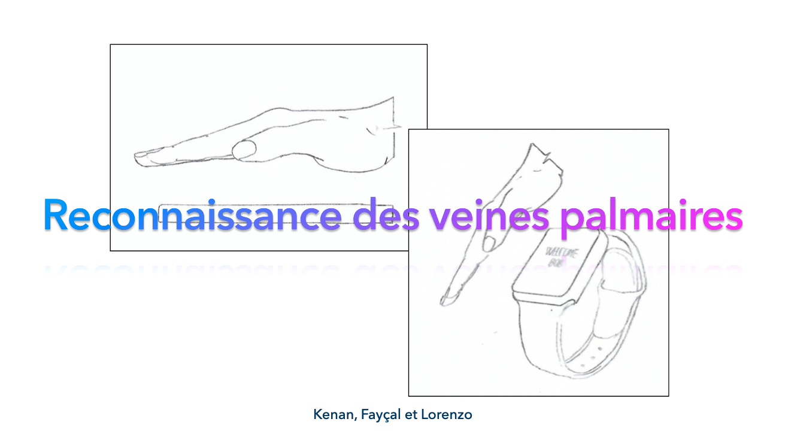

# Application web - Flask - Déploiement d'un modèle CNN avec Keras

Voici l'architecture de l'application web Flask qui permet de déployer un modèle CNN avec Keras.

Information sur le projet : 
* **"deployed_model"** => Dossier contenant les modèles déployés (*.json est l'architecture du modèle, *.h5 est le modèle entrainé)
* **"static"** => Dossier contenant les fichiers statiques (images, css, js, etc.)
* **"templates"** => Dossier contenant les fichiers html
* **"app.py"** => Fichier principal de l'application
* **"requirements.txt"** => Fichier contenant les dépendances nécessaires à l'application
* **"Dockerfile"** => Fichier contenant les instructions de Docker
* **"uploads"** => Dossier contenant les fichiers uploadés par l'utilisateur